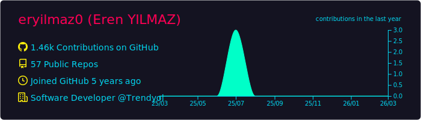
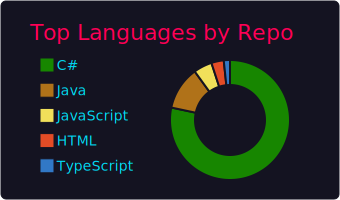
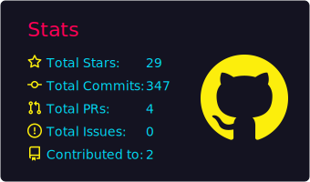

<h2 align="center">👋 Hi, I’m Eren Yilmaz</h2>

  
  &nbsp;&nbsp;

Welcome to my GitHub profile. I am a software developer (mostly backend), I am sharing my projects and new learned skills as much as I can. 

 

  
  

<h2 align="center">## 📈 GitHub Stats</h2>

